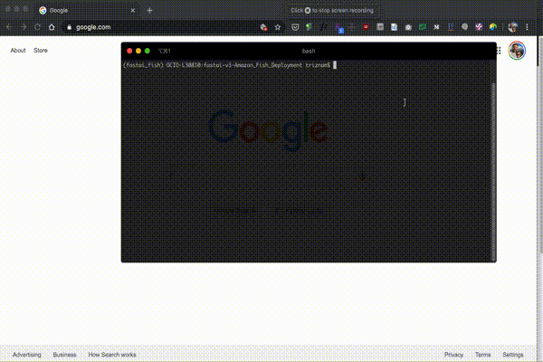

# Local fish identifier

## Install instructions

First, ensure that you have miniconda installed. Miniconda instructions are here: https://docs.conda.io/en/latest/miniconda.html#miniconda.

Run the following command to create a custom conda environment for this app:

`conda env create -f environment.yml`

You will then need to activate the new environment:

`conda activate fastai_fish`

## Launching the app

Ensure that your conda environment is activated. Your command prompt should start with (fastai_fish).

In this directory, run the following command to launch the app:

`python app/server.py serve`

If it worked correctly, the program will automatically open a browser window at the address "http://localhost:5000/".

